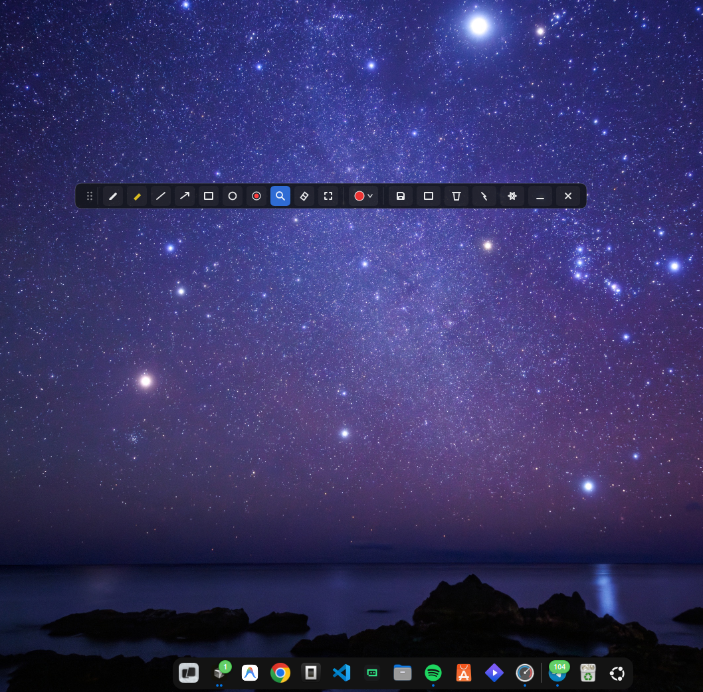
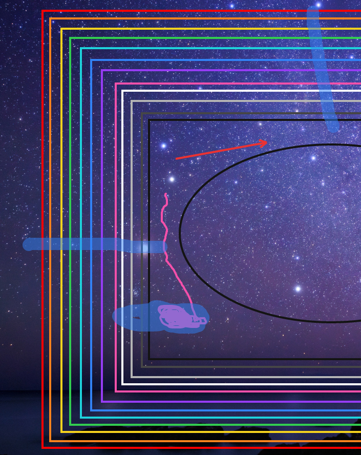

# Vectrace

<p align="center">
  
</p>

<p align="center">
  <strong>Agnostic Vector Screen Marker & Annotation Overlay for X11 & Wayland</strong>
</p>

<p align="center">
  <a href="https://github.com/jigonzalez930209/vectrace/actions"></a>
  <a href="LICENSE"></a>
  <a href="https://jigonzalez930209.github.io/vectrace/"></a>
</p>

---

## 🌟 Overview

**Vectrace** is a ultra-fast, pure-software vector screen marker and drawing overlay designed for Linux environments. Whether presenting, recording tutorials, analyzing graphics, or highlighting live code, Vectrace gives you a smooth floating canvas over your entire desktop.

- ⚡ **Zero Latency Rendering**: Powered by `tiny-skia` with Catmull-Rom spline stroke smoothing.
- 🪟 **X11 & Wayland Native**: Works seamlessly on X11 and Wayland (via Layer-Shell & XDG-Shell).
- 🎨 **Rich Toolset**: Pen, Highlighter, Lines, Arrows, Rectangles, Ovals, Text Tool, Neon Laser Mode (with decay), Spotlight Dimmer, and Crop Region Snapshot.
- 🚀 **Click-Through Toggle**: Instantly pass mouse inputs to underlying applications (`Ctrl+Alt+A` or `Space`).
- 📷 **High Performance Screen Snapshots**: Instantly capture full desktop or cropped regions directly into your clipboard and Pictures folder.

---

## 📸 Screenshots & Showcase

| Hero Showcase | Floating Glassmorphic Toolbar |
| :---: | :---: |
|  |  |

| Spotlight & Laser Effects | Crop Snapshot Tool |
| :---: | :---: |
|  |  |

---

## 📥 Installation

### 1. AppImage (Universal Linux - Recommended)
No installation or root privileges required. Download and run:
```bash
chmod +x Vectrace-v0.2.4_64.AppImage
./Vectrace-v0.2.4_64.AppImage
```

### 2. Debian / Ubuntu / Linux Mint (.deb)
```bash
sudo dpkg -i vectrace_0.2.4_amd64.deb
sudo apt-get install -f # Fix missing dependencies if needed
```

### 3. Fedora / RHEL / CentOS / openSUSE (.rpm)
```bash
sudo rpm -i vectrace-0.2.4-1.x86_64.rpm
# or with dnf:
sudo dnf install ./vectrace-0.2.4-1.x86_64.rpm
```

### 4. Arch Linux / Manjaro (PKGBUILD)
```bash
cd packaging/arch
makepkg -si
```

---

## 📦 System Dependencies & Prerequisites

When building from source or running standalone binaries, ensure the following native packages are installed on your distribution:

### Debian / Ubuntu
```bash
sudo apt-get update
sudo apt-get install -y \
  build-essential \
  libx11-dev \
  libxext-dev \
  libxrender-dev \
  libwayland-dev \
  libdbus-1-dev \
  libpipewire-0.3-dev \
  libclang-dev
```

### Fedora / RHEL
```bash
sudo dnf install -y \
  gcc \
  libX11-devel \
  libXext-devel \
  libXrender-devel \
  wayland-devel \
  dbus-devel \
  pipewire-devel \
  clang-devel
```

### Arch Linux
```bash
sudo pacman -S --needed \
  base-devel \
  libx11 \
  libxext \
  libxrender \
  wayland \
  dbus \
  pipewire \
  clang
```

---

## ⌨️ Keyboard Shortcuts & Controls

| Shortcut | Action |
| :--- | :--- |
| `Ctrl + Alt + A` | **Global Daemon Shortcut**: Toggle Overlay Active / Click-Through |
| `Space` | Toggle Click-Through (Mouse Pass-Through) |
| `P` | Select **Pen** tool |
| `H` | Select **Highlighter** tool |
| `L` | Select **Line** shape tool |
| `A` | Select **Arrow** shape tool |
| `R` | Select **Rectangle** shape tool |
| `O` | Select **Oval** shape tool |
| `E` | Select **Eraser** tool |
| `T` | Select **Text** tool |
| `K` | Select **Neon Laser** pointer tool |
| `N` | Select **Spotlight** dimmer mode |
| `M` | Minimize overlay to System Tray |
| `Ctrl + Shift + S` / `Ctrl + C` | Activate **Crop Selection** tool |
| `S` | Take **Full Screen** snapshot (or confirm Crop if selection is active) |
| `U` | Undo last stroke |
| `Ctrl + R` | Redo last stroke |
| `C` | Clear all drawings on screen |
| `B` | Cycle Background Mode (Transparent ➔ Blackboard ➔ Whiteboard) |
| `ESC` | Cancel active tool / Clear selection / Exit application |

---

## 🛠️ Building from Source

Ensure you have Rust (MSRV 1.80+) installed via [rustup.rs](https://rustup.rs/):

```bash
# Clone repository
git clone https://github.com/jigonzalez930209/vectrace.git
cd vectrace

# Build release binary
cargo build --release

# Run
./target/release/vectrace
```

---

## 📄 License & Attribution

Vectrace is free software licensed under the **GNU General Public License v3.0** (GPL-3.0).

- [GNU General Public License v3.0](LICENSE)

---

## 📖 Complete Documentation & GitHub Pages

For comprehensive guides, interactive controls, architectural diagrams, and troubleshooting, visit the official documentation:
👉 **[https://jigonzalez930209.github.io/vectrace/](https://jigonzalez930209.github.io/vectrace/)**
